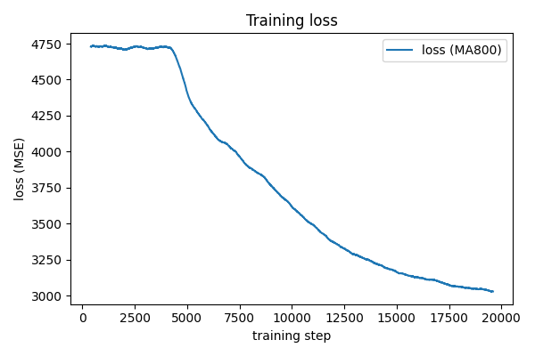
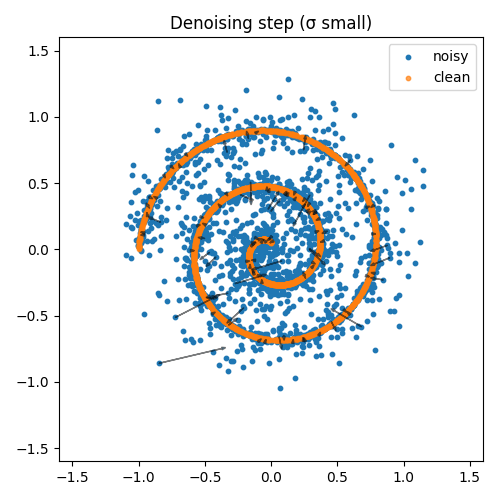

# 🧠 Toy Diffusion Model (2D)

*A minimal working example of a diffusion model implemented from scratch with PyTorch.*

---

## 📘 Overview
This repository provides a **clean, educational implementation** of a 2D diffusion model trained on a synthetic *Swiss Roll* dataset.  
It aims to help students and researchers understand the **core principles of denoising diffusion models** without heavy dependencies.

### ✨ Key Features
- Custom noise schedule (`ScheduleLogLinear`)
- Sigma embedding with sinusoidal encoding
- Simple **MLP (Multi-Layer Perceptron)** noise predictor
- **Weighted MSE loss** emphasizing small-noise precision
- Fail-fast debugging, gradient clipping, and cosine LR scheduler
- Visualization of denoising direction in 2D

---

## 🧩 File Structure
